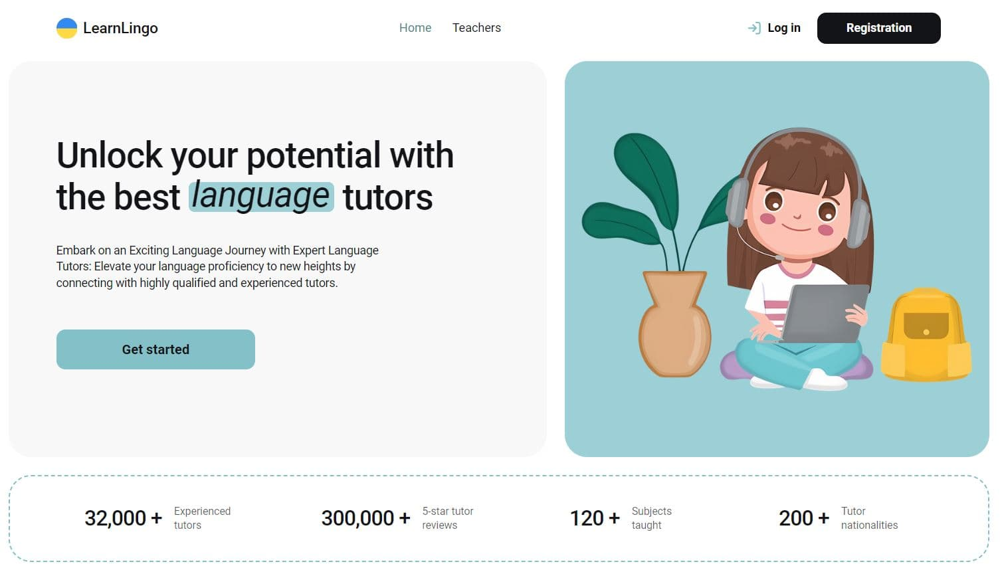
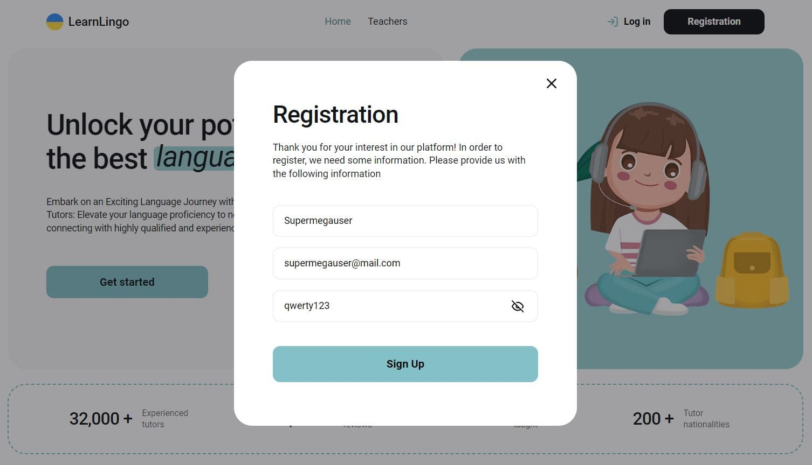
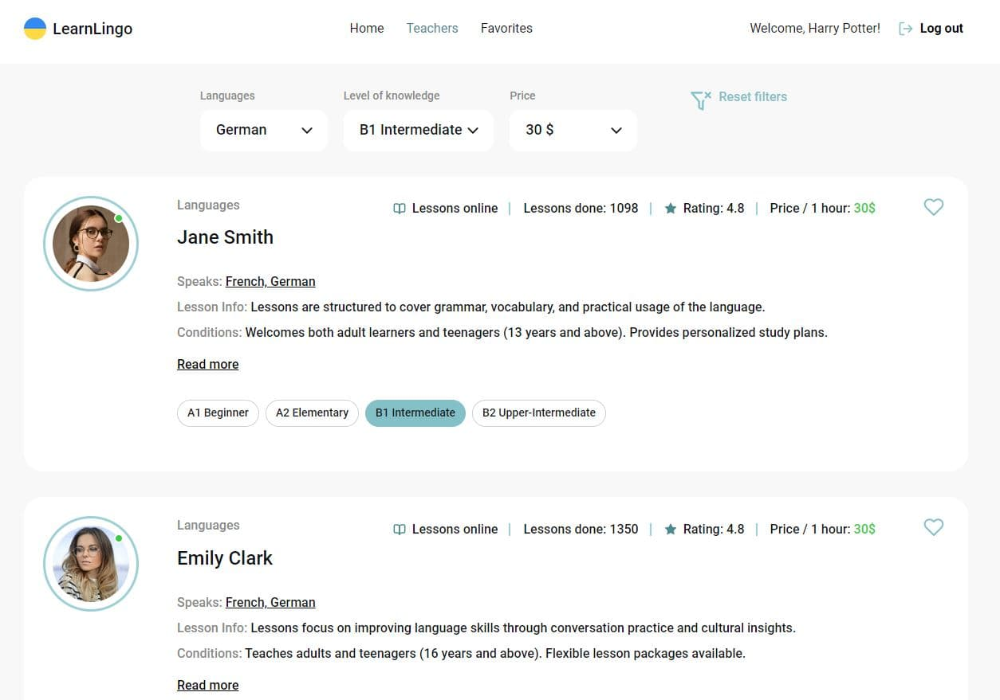
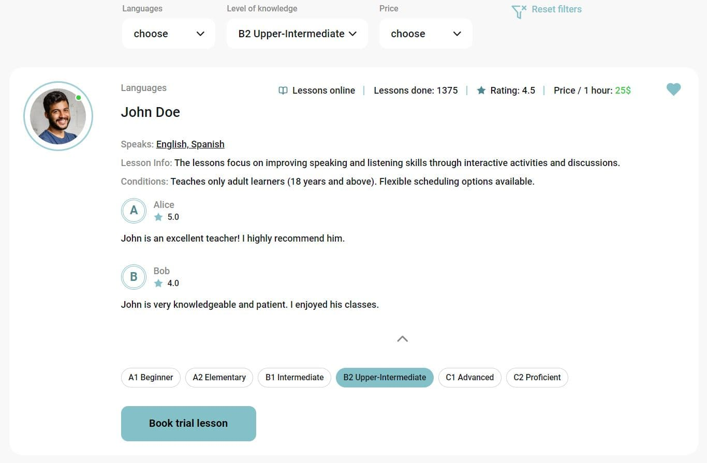
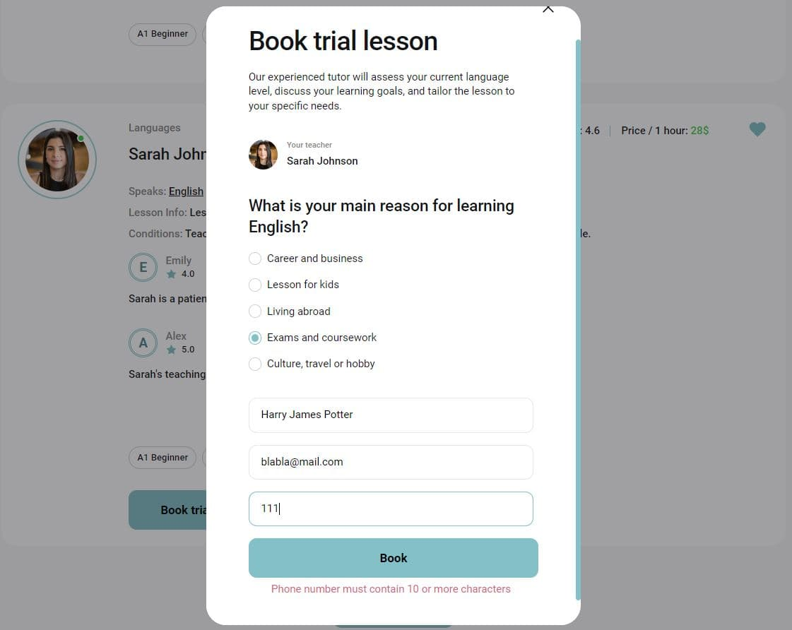
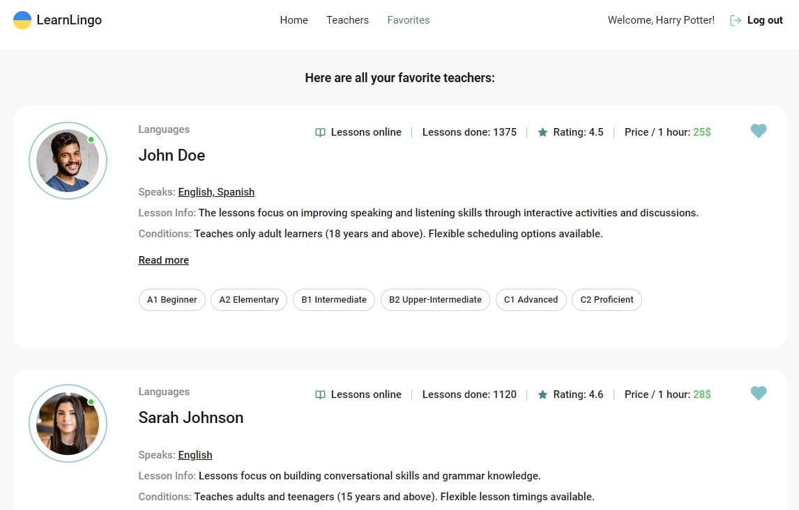

# Lingua

Lingua is a platform that provides the database of foreign languages teachers.

## Used technologies

## Authentification

Authenticated users have more privilegues. They can save their favorite teachers.
Signing up and in is realised using Firebase Auth.

## Usage

Once the project is set up, you can browse through the catalog of teachers, filter them, view
detailed information, and book trial lessons.

## Features

- Filter teachers by languages, study levels and prices (languages and prices are browsed from database)
  

- View detailed information and reviews for each teacher
  

- Book trial lessons
  

- Add teachers to favorites for quick access (for signed in users)
  

## Contact

For questions or support, contact us at `https://github.com/AliceBondMe`
